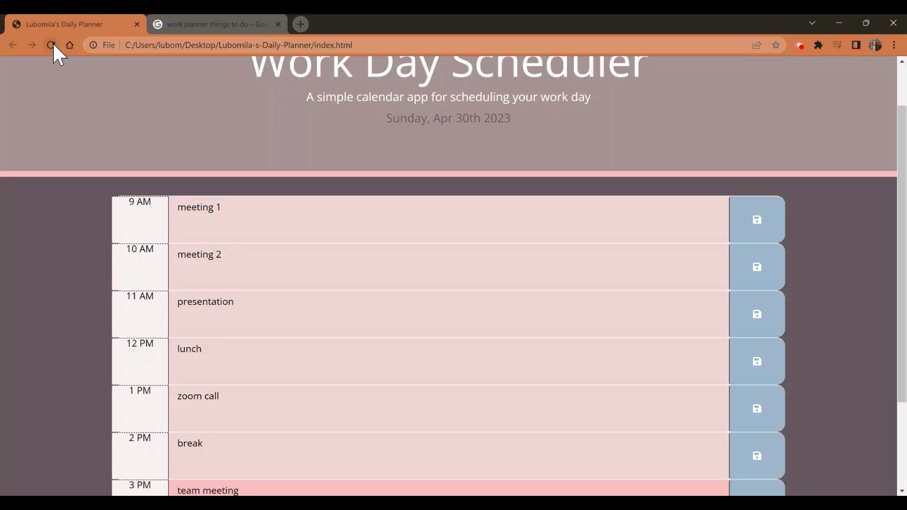

# Lubomila-s-Daily-Planner
Third-Party APIs

## Description

"Lubomila's Daily Planner" calendar application that allows a user to save events for each hour of the day. The app runs into the browser and features HTML, CSS, JavaScript, jQuery and Moment Js.

## Installation

Follow the link for the deployed website [Daily-Planner](https://milla56.github.io/Lubomila-s-Daily-Planner/) 

## Usage
The list shows what steps were made to complete the challenge:
 - Once the planner is open, the user can see the current day at the top of the calendar.
 
 - To display the current date I used Moment.js library.
 - Scrolling down to the planner, the user will be able to see the time blocks for standard business hours (9am - 5pm).
 - Depending on when the time block is viewed, the color code for each time block is different based on past, present and future.
 - The users are allowed to enter an event when they click a timelock. 
 
 - The event will be saved when the "save button" is clicked.
 - If the page is refreshed, the events still will be saved.
 
 - To make the app more personalised, I created an individua color palette.

## Credits

N/A

## License

milla56/Lubomila-s-Daily-Planner is licensed under the

MIT License
A short and simple permissive license with conditions only requiring preservation of copyright and license notices. Licensed works, modifications, and larger works may be distributed under different terms and without source code.